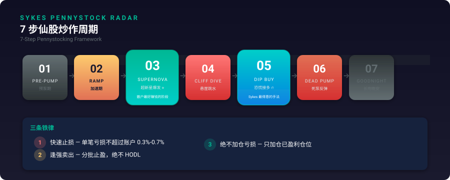
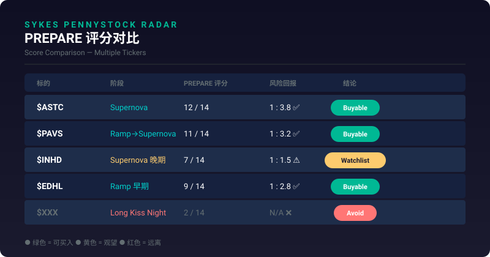
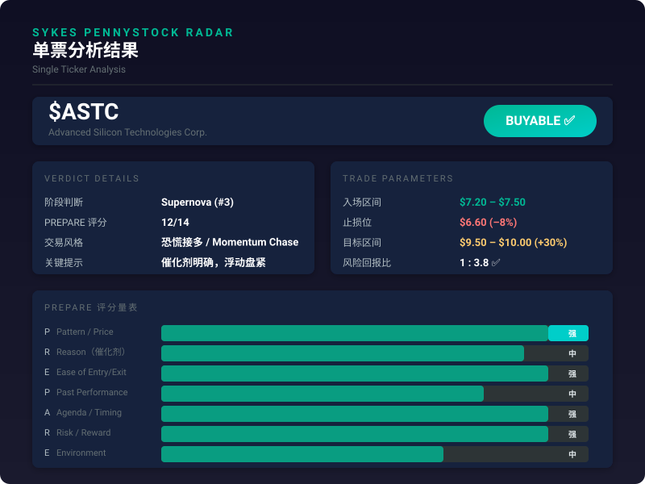

# Sykes Pennystock Radar

把 Timothy Sykes 的仙股交易方法论，蒸馏成一个可重复调用的 Agent Skill。

它不负责预测下一只妖股是谁，它负责回答另一件更重要的事：

**这只票，现在到底能不能做。**

详细产品说明见：[中文产品说明](./docs/product-introduction.zh.md)

## 导航

- [这个项目是干什么的](#这个项目是干什么的)
- [为什么值得做成一个技能](#为什么值得做成一个技能)
- [核心输出](#核心输出)
- [适合谁用](#适合谁用)
- [底层逻辑](#底层逻辑)
- [怎么使用](#怎么使用)
- [ASTC 案例](#astc-案例)
- [产品图](#产品图)
- [文档](#文档)

## 这个项目是干什么的

`Sykes Pennystock Radar` 适合两类场景：

1. 你输入一个 ticker，想知道它现在值不值得买
2. 你想从一批美股小票里，先筛出更有交易价值的候选

它会把 Timothy Sykes 那套“看阶段、看催化剂、看量能、看风险回报”的思路，变成结构化输出。

你最后拿到的不是一堆模糊评价，而是明确判断：

- `Buyable`
- `Watchlist Only`
- `Avoid`

同时会附带：

- 当前所处的 7 步周期阶段
- PREPARE 评分
- 入场 / 失效 / 出场思路
- 更适合追涨、恐慌接多，还是干脆别碰

## 为什么值得做成一个技能

美股小票最烦的地方，不是它不涨。

而是你永远搞不清楚，它现在到底是：

- 刚启动
- 已经拉完
- 还可以追
- 还是只剩最后一口气

很多票都有故事，也都有截图，也总有人说“这票要飞了”。

问题是，交易不是看故事感，交易看的是：

- 催化剂是不是新的
- 量能是不是异常的
- 流动性够不够
- 阶段对不对
- 风险回报值不值得出手

这个项目的意义，就是把这些判断前置。

很多人缺的不是“看盘热情”，而是一个足够稳定的过滤框架。

这个 skill 试图把最容易出错的几个环节，直接标准化：

- 先判断是不是交易窗口
- 再判断有没有出手价值
- 最后才讨论怎么进、怎么退

## 核心输出

当你输入一个 ticker，技能会尽量给出一份能直接拿来判断的交易摘要：

| 模块 | 输出内容 |
|---|---|
| 阶段判断 | 当前处于 7 步周期的哪一步 |
| 交易结论 | `Buyable` / `Watchlist Only` / `Avoid` |
| PREPARE 评分 | 各维度强弱与整体可交易性 |
| 执行建议 | 更偏追涨、接多、等待，还是放弃 |
| 风险控制 | 失效条件、止损位置、分批止盈思路 |

它的重点不是把内容讲复杂，而是把结论讲明白。

## 适合谁用

这个项目更适合下面几种用户：

- 会看盘，但不想每天在一堆小票里乱翻的人
- 对低价股、异动股、short squeeze 有兴趣的人
- 想把“感觉能做”变成规则化判断的人
- 想把 Timothy Sykes 的方法论变成可调用流程的人

如果你追求的是长期基本面研究，这个项目就不是那个方向。
它服务的是交易窗口，不是价值投资。

## 底层逻辑

项目基于 Timothy Sykes 的两层框架：

### 1. 7 步仙股周期

任何一只小票，基本都可以落在这 7 个阶段里：

1. `Pre-Pump` 预泵期
2. `Ramp` 加速期
3. `Supernova` 超新星爆发
4. `Cliff Dive` 悬崖跳水
5. `Dip Buy` 恐慌接多
6. `Dead Pump Bounce` 死泵反弹
7. `Long Kiss Goodnight` 长吻晚安

真正最有交易价值的，往往是：

- `#3 Supernova`
- `#5 Dip Buy`

### 2. PREPARE 评分量表

每个标的都会按 7 个维度打分：

- `P` Pattern / Price
- `R` Reason
- `E` Ease of Entry / Exit
- `P` Past Performance
- `A` Agenda / Timing Window
- `R` Risk / Reward
- `E` Environment

这套技能本质上就是在做一件事：

**把“感觉这票有戏”，变成“为什么能做 / 为什么不能做”的规则化判断。**

## 怎么使用

### 单票判断

输入一个 ticker，比如：

- `ASTC`
- `PAVS`
- `INHD`
- `EDHL`
- `STI`

技能会输出：

1. 当前阶段
2. PREPARE 评分
3. 交易结论
4. 入场思路
5. 失效条件
6. 出场建议

### 小票池扫描

如果接入一批美股小票，它可以按以下顺序筛选：

1. 催化剂新不新
2. 浮动盘紧不紧
3. 成交量异不异常
4. 当前是不是交易窗口
5. 风险回报合不合理
6. 流动性够不够

它更像一个“交易门禁系统”，先帮你把大量不值得看的票挡在门外。

### 一次完整调用会发生什么

你可以把它理解成 4 个连续动作：

1. **看阶段**  
   先判断这票是不是还在可交易区。

2. **看条件**  
   催化剂、量能、流动性、环境是否够格。

3. **看回报**  
   风险回报如果不合适，再热也不做。

4. **给结论**  
   输出明确 verdict，而不是模糊建议。

### 最常见的两种用法

#### 用法 1：问单票

你说：`帮我看一下 ASTC 现在能不能做`

它会回答：

- 处于哪个阶段
- 为什么能做 / 不能做
- 如果做，应该怎么做
- 如果错，什么时候退

#### 用法 2：扫一批美股小票

你说：`帮我从这批美股小票里筛一下有机会的`

它会先筛掉这些：

- 没催化剂的
- 流动性太差的
- 已经过晚的
- 风险回报不划算的

剩下的再按优先级排序。

## ASTC 案例

这是一个最典型的结构化输出示例。

当你输入 `"$ASTC"`，技能可以给出这样的判断：

- 形态：进入 `Supernova` 爆发期（模式 #3）✅
- 流动性：日均成交量达标 ✅
- 催化剂：有新闻驱动（合同 / 合作）✅
- 历史表现：过去同类模式下表现一致 ✅
- 风险回报：当前入场点距止损 8%，目标利润 30%+（1:4）✅

结论：

> 符合入场条件。建议小仓位，设 8% 止损，分批止盈。

重点不在于“它一定会涨”，而在于：

- 这单为什么能做
- 如果做，怎么做
- 如果错，怎么退

## 你实际得到的，不只是一个结论

很多“荐股式工具”的问题在于，它只告诉你一个方向，却不告诉你边界。

这个项目更在乎边界感：

- 什么条件下能做
- 什么条件下不能做
- 做错了应该怎么撤
- 做对了为什么不能恋战

这也是它和“喊单”最大的区别。

## 产品图

### 7 步周期图

### PREPARE 评分图

### 单票分析图

## 项目定位

这个项目不是荐股工具，也不是预测引擎。

它更接近一个交易过滤器：

- 帮你判断现在是不是出手时机
- 帮你过滤掉不值得做的票
- 帮你把“冲不冲”变成更纪律化的决策

如果只用一句话来概括它：

> 不是看到一只票就买，而是先判断它现在到底走到了哪一段。

## 文档

- [中文产品说明](./docs/product-introduction.zh.md)
- [方法论参考](./references/sykes-framework.md)

## License

MIT
